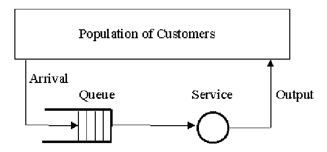
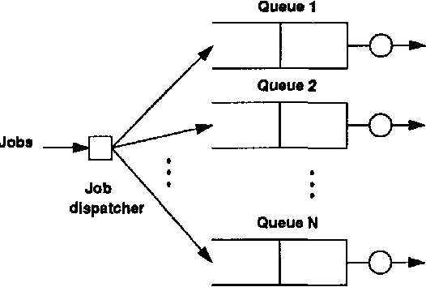
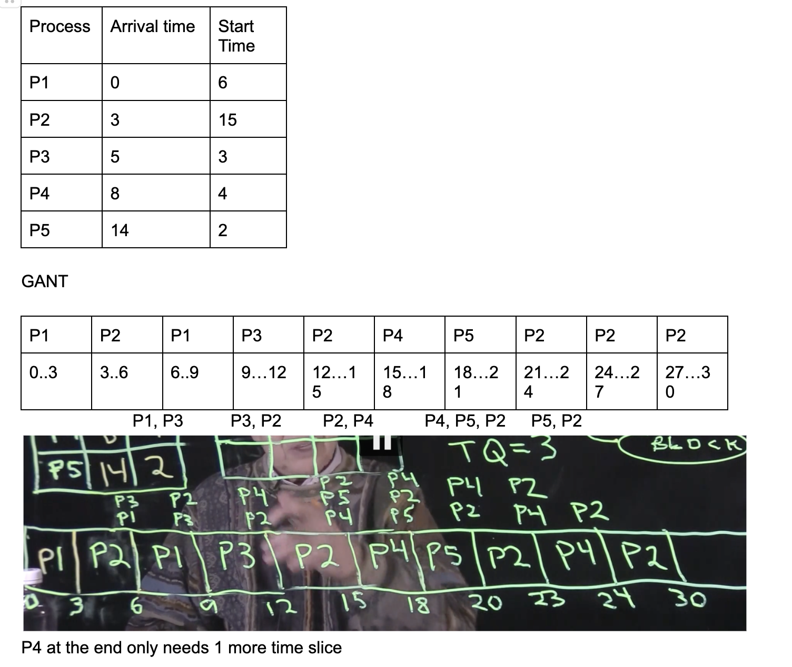
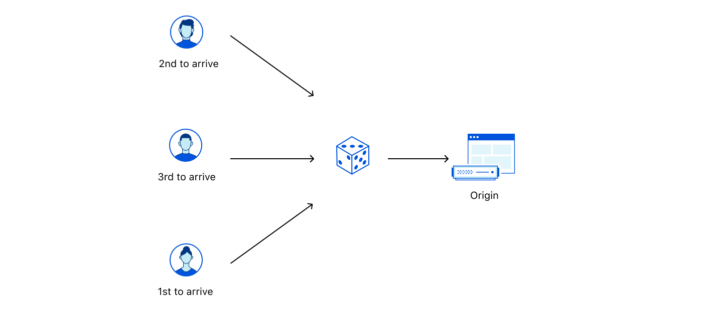

# Queue Simulation System 

## Table of Contents
1. [Overview](#overview)
2. [Queue Management Policies](#queue-management-policies)
   - [Single Queue](#single-queue)
   - [Shortest Queue](#shortest-queue)
   - [Round Robin](#round-robin)
   - [Random Queue](#random-queue)
3. [Requirements](#requirements)
4. [Usage](#usage)
5. [Main Classes](#main-classes)
   - [Passenger](#passenger)
   - [ServiceStation](#servicestation)
   - [QueueSimulation](#queuesimulation)
6. [Functions](#functions)
   - [run_simulation(policy)](#run_simulationpolicy)
   - [update_max_queue_length()](#update_max_queue_length)
   - [log_queue_stats()](#log_queue_stats)
   - [any_passengers_remaining()](#any_passengers_remaining)
   - [reset_simulation()](#reset_simulation)
   - [handle_arrivals()](#handle_arrivals)
   - [select_station()](#select_station)
   - [handle_departures()](#handle_departures)
   - [calculate_results()](#calculate_results)
7. [Analysis](#analysis)
    - [Service Station Occupancy](#service-station-occupancy)
    - [Average Waiting Time](#average-waiting-time)
    - [Maximum Waiting Time](#maximum-waiting-time)
    - [Maximum Queue Length and Simulation Duration](#maximum-queue-length-and-simulation-duration)
8. [Conclusion](#conclusion)

# Overview

This queue simulation program is designed to model the flow of passengers through 5 service stations, using various queue management policies. It simulates the arrival, service, and departure of passengers, allowing the analysis of queue lengths, waiting times, and service station occupancy rates.

# Queue Management Policies

This documentation will highlight the following four queue management policies; single queue, shortest queue, round robin, and random queue. 

## Single Queue

The single queue policy joins all passengers in one global queue, regardless of which service station they will use. Passengers will move to the first available service station, resulting in a First-In-First-Out scheduling policy.

This queue system is common in ticket booths or store lines, when the order of the customers matter but the station being serviced at does not. Unfortunately, this policy can lead to high waiting times when all stations are busy. The diagram below demonstrates the process of customers entering a common queue in FIFO, recieving service, and departing. 



## Shortest Queue

The shortest queue policy focuses on diverting passengers to the service station with the shortest queue at the time of their arrival. This method will minimize a passenger's waiting time and help balance the load between the five stations.

This queue system is common in supermarket checkouts where each station operates independently of each other and customers main focus is on service speed. As shown in the image below, the jobs(customers) are being directed (by the job dispatcher) to the queue with the shortest line. 



## Round Robin

The round robin policy will assign passengers to service stations in a cyclical fixed order, regardless of the stations queue length. After reaching the fifth station, it loops back to the first and begins assigning again in the same order. This policy provides an equal distribution of passengers across stations, but does not take into account varying service times and queue lengths.

In many operating systems, this policy will invoke a 'time slice' which is a fixed number of time units before the OS returns a process to the ready state. In our scenario, we did not allow for time slices because that is not realistic. However, the chart below shows five processes arriving at different times and a time slice of 3. As we can see, the job dispatcher goes from P1 --> P2 --> P1. In this example, the OS returned to P1 because P1 never finished due to a time slice and arrived before P3.  



## Random Queue 

The random queue policy will assign each arriving passenger to a random service station each time. This system may lead to unequal distribution or unpredictability when testing.

The diagram below demonstrates how each customer is arbitrarily assigned to a queue without taking into consideration any impacting factors.



### Requirements
- Python 3.x

## Usage

To run the simulation, execute the script with Python:

```bash
python3 queue_simulation.py
```

# Classes

## Passenger

- arrival_time: Time when the passenger arrives
- service_time: Randomly assigned service time between 5 to 8 minutes
- start_service_time: Time when passenger's service begins

## ServiceStation

- queue: FIFO queue for passengers
- busy: Indicates if the station is servicing a passenger
- total_service_time: Cumulative time spent servicing passengers
- current_passenger: The passenger currently being serviced
- max_queue_length: Maximum length of the queue at any time
- waiting_times: List of waiting times of all serviced passengers

## QueueSimulation

- num_stations: Number of service stations in the simulation
- arrival_rate: Average rate at which new passengers arrive
- duration: Predefined duration of the simulation in minutes
- effective_duration: Actual duration including service completion post-initial period
- max_queue_length: Maximum queue length observed across all stations or in the global queue
- stations: Array of ServiceStation objects
- time: Current time within the simulation
- current_station: Index for the next station in round-robin policy
- global_queue: Global queue for the single queue policy
- total_passengers: List of all passengers that have arrived
- policy: Current queue management policy

# Functions

## run_simulation(policy)
This function will run the queue simulation under the specified queue management policy. It will begin by reseting the simulation to a clean state, handling the passenger arrivals and departures, updating the queue lengths, logging queue statistics, and finally calculating the results.

## update_max_queue_length()
This function will update the maximum queue length statistic based on the policy. This function tracks the maximum number of passengers waiting in the queue for the `Single Queue` policy or across all stations for other policies.

## log_queue_stats()
This function tracks the real-time evolution of the queue and each service station at a specified interval. It displays information on queue lengths, whether stations are busy, and the current service time for the passenger being serviced.

## any_passengers_remaining()
This function determines if any passengers are still waiting or being serviced, which ultimately tells the simulation if it should continue running beyond the predefined `duration`.

## reset_simulation()
This function will reset the simulation to its initial state by clearning all previous queues and stations, as well as preparing the system for a new run under a different policy.

## handle_arrivals()
This function checks for the arrival of new passengers based on the arrival rate and adds them to the queue according to the current policy. A new `Passenger` instance will be created and queued if necessary.

## select_station()
This function selects a service station for a new passenger based on the current queue management policy. 

## handle_departures()
This function will process the passengers who's service has finished. It will check if the station is busy and service is completed, and then updating the station and passenger state accordingly.

## calculate_results()
This function will calculate and print the simulation's final statistics, including maximum queue lengths, average waiting times, maximum waiting times, and service station occupancy rates. This function is called after the simulation ends to provide insights into the performance of the queue management policy used.

# Analysis

The analysis below was taken with a duration of 9999, arrival rate of 1.2, and service rate randomly chosen between 5-8 minutes. 

## Service Station Occupancy

The rate of service station occupancy determines how busy the station was servicing a passenger. 

- Single Queue: Each station reached almost a 100% occupancy rate, ranging from 99.93 - 99.99%.
- Random Queue: Stations ranged between 90.94% to 99.97% occupancy rate.
- Round Robin: Each station reached almost a 100% occupancy rate, ranging from 99.32% - 99.97.
- Shortest Queue: Each station reaches almost a 100% occupancy rate, rantging from 99.25% - 99.95%.

## Average Waiting Time

The average waiting time finds the average time each passenger waiting at each station for each policy.

- Single Queue: The global queue had an average waiting time was between 1995 and 1998 minutes. 
- Random Queue: Each station had an average wait between 1661.38 and 2283.05 minutes.
- Round Robin: Each station had an average wait between 1967.02 and 2016.66 minutes.
- Shortest Queue: Each station had an average wait between 1993.29 and 2012.53 minutes.

## Maximum Waiting Time

The maximum waiting time finds the highest amount of time a passenger waiting for at each station depending on the specified policy.

- Single Queue: Across all five stations, the maximum waiting time was between 3992 and 3995 minutes.
- Random Queue: Each station had a maximum waiting time between 3300 and 4598 minutes. 
- Round Robin: Each station had a maximum waiting time between 3945 and 4033 minutes.
- Shortest Queue: Each station had a maximum waiting time between 3957 and 4056 minutes.

## Maximum Queue Length and Simulation Duration

- Single Queue: The simulation took 14024 minutes and the global queue reached a maximum length of 2851 passengers. 
- Random Queue: The simulation lasted 14600 minutes and reached a maximum queue length of 548 (Station 1), 473 (Station 2), 620 (Station 3), 660 (Station 4), 570 (Station 5) passengers.
- Round Robin: The simulation lasted 14038 minutes and reaches a maximum queue length of 572 (Station 1), 573 (Station 2), 574 (Station 3), 568 (Station 4), 566 (Station 5) passengers.
- Shortest Queue: The simulation lasted 14062 minutes and reaches a maximum queue length of 572 (Station 1), 572 (Station 2), 572 (Station 3), 572 (Station 4), 572 (Station 5) passengers.

# Conclusion

The data suggests that either the Single Queue or the Shortest Queue policy are the most effective strategies over extended periods of time. In terms of the shortest queue policy, it manages to keep a good balance between maximum queue lengths, maintains lower average and maximum waiting times compared to other policies, and ensures high service station occupancy. By efficiently allocating passengers across the five stations, it prevents any single station from becoming bottlenecked, thus optimizing wait times and sustaining high occupancy rates. This approach demonstrates a comprehensive management of queues, ensuring both operational efficiency and an improved passenger experience. On the other hand, the single queue policy showed little range in maximum or average waiting time between all five stations. This policy also had the most busy stations out of all four policies. 